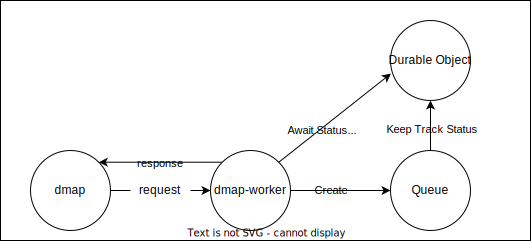

# ActionSchema - Distributed Maps For Typescript

`dmap` allows executing map functions in a distributed fashion by adding it to a queue and waiting for all results so you're not constrained by memory and other limitations of serverless environments, such as max 6 concurrent fetches.

# Cloudflare Blog (Draft)

# Making distributed code execution easier to write

This is easy for a worker to do within 128MB of RAM, very fast because of the runtime optimisations:

```ts
const array: number[] = new Array(100000).fill(null).map((_, index) => index);
const squares = array.map((n) => n * n);
console.log(squares);
// executes in < 7 ms
```

This isn't because Cloudflare has a max concurrency of 6 parallel fetches at any given time. Also a worker has a limit of maximum 1000 subrequests. If the fetch takes 1 second, for a 1000 items it would take (1000/6) x 1s = 166.7 seconds to complete

```ts
const array: number[] = new Array(100000).fill(null).map((_, index) => index);
const squares: number[] = await Promise.all(
  array.map((n) =>
    fetch("https://api.openai.com/chat/completions", {
      method: "POST",
      body: JSON.stringify({
        messages: [
          {
            role: "user",
            message: `What's the square root of ${n}? Return just the number`,
          },
        ],
      }),
      headers: { Authorization: `Bearer YOUR_API_KEY` },
    })
      .then((res) => res.json())
      .then((json) => Number(json.choices[0].message.content.trim())),
  ),
);
// will never finish.
```

To address this problem Cloudflare has workflows and queues. But workflows make your code ugly. What if we could just write it like this?

```ts
const array: number[] = new Array(100000).fill(null).map((_, index) => index);
const squares: number[] = await dmap(array, (n) =>
  fetch("https://api.openai.com/chat/completions", {
    method: "POST",
    body: JSON.stringify({
      messages: [
        {
          role: "user",
          message: `What's the square root of ${n}? Return just the number`,
        },
      ],
    }),
    headers: { Authorization: `Bearer YOUR_API_KEY` },
  })
    .then((res) => res.json())
    .then((json) => Number(json.choices[0].message.content.trim())),
);
```

In this example a new utility function `dmap` is introduced as a new syntactic sugar that allows executing code in distributed fashion across workers using a pool of queues while keeping the simplicity of code.



dmap allows creating queues while you can still get still await the response of every item and execute the rest of your code after. This creates a much simpler way to do workflows. Because of the ability of queues to scale in parallel, dmap makes expensive operations much faster to complete in a worker environment. For example, the above example could take just 5 seconds.
